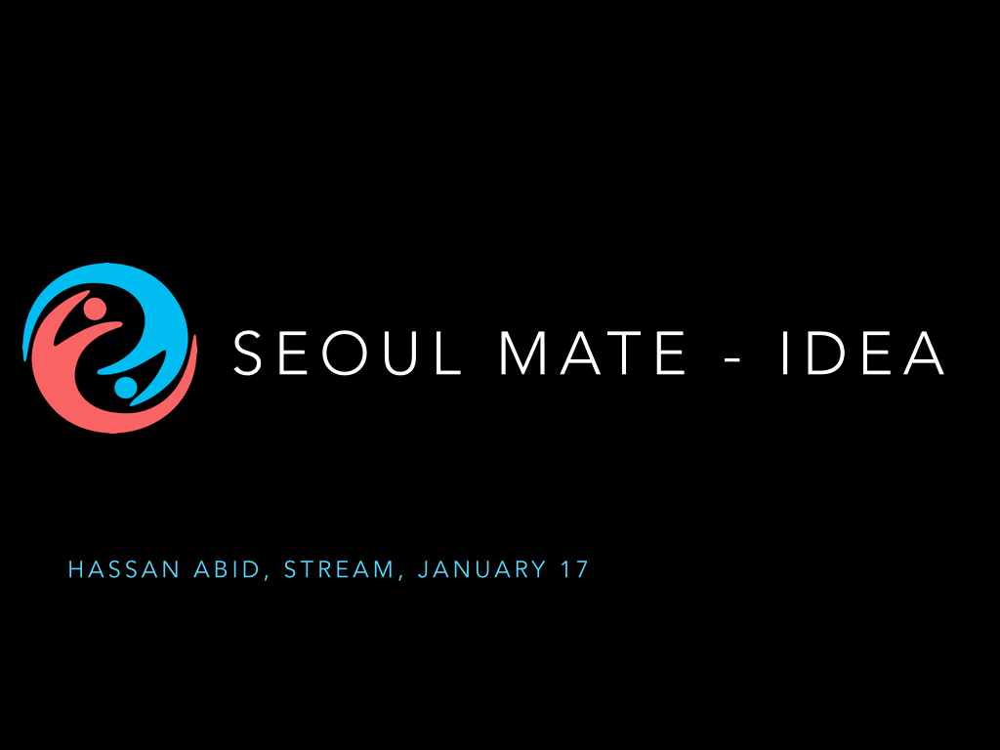

# Stream
We will use this Github repository to share code (Web, iOS and Android) among team members. 

Find attached our presentation on <a href="http://www.slideshare.net/HassanAbid1/seoul-mate-at-stream">slideshare</a> 

[Seoul Tech Society] - Lauch Lab: MOOC + 기업가정신 + 팀 프로젝트
by. 하산 아비드

Seoul Mate idea was presented at Launch Lab, organized by Seoul Tech Society in Korea. It received positive response from enthusiastic audience. During the 6 months STREAM program, we will develop Seoul Mate into a real platform by taking guidance from MIT's MOOCs on Entrepreneurship, Innovation and Commercialization

서울 거주 외국인 개발자 커뮤니티인 "서울 테크 소사이어티(seoultechsociety.org)" 에서 무크를 활용한 행사, 이른바 "Lauch Lab" 를 진행한다는 소식을 접하고 이벤트에 참석했습니다. 저는 여기서 외국인 유학생을 위한 앱 Seoul Mate 아이디어를 제안하여 스피커로 참여했습니다. 제가 만든 안드로이드 앱이 궁금하시면 링크를 클릭해주세요. (http://goo.gl/7dFOw2) 

"Lauch Lab"는 edX 기업가정신 101/102 코스(https://www.edx.org/course/entrepreneurship-101-who-customer-mitx-15-390-1x) 를 함께 들으며 웹 / 앱 등을 6개월 동안 개발하는 팀 프로젝트입니다.

6명의 메인 스피커들이 자신이 구상하고 있는 프로젝트를 발표하고,
원하는 사람들은 함께 팀원으로 참여할 수 있습니다 이외에 뜻이 맞는 구성원들이 함께 모여 팀을 꾸려 프로젝트를 진행할 수 있습니다.

1달에 한번씩 프로젝트 진행상황을 브리핑하는 시간을 갖고, 많은 전문가들에게 도움을 받을 수 있는 멘토링 기회를 제공한다고 합니다. 관심있는 분, 외국인 개발자들과 함께 프로젝트를 진행해보고 싶은 분들은 아래 MeetUp페이지에서 팔로우업 하세요 smile emoticon

MeetUP: http://www.meetup.com/seoul-tech-society/
이벤트 링크 : http://seoultech.github.io/stream/

 
