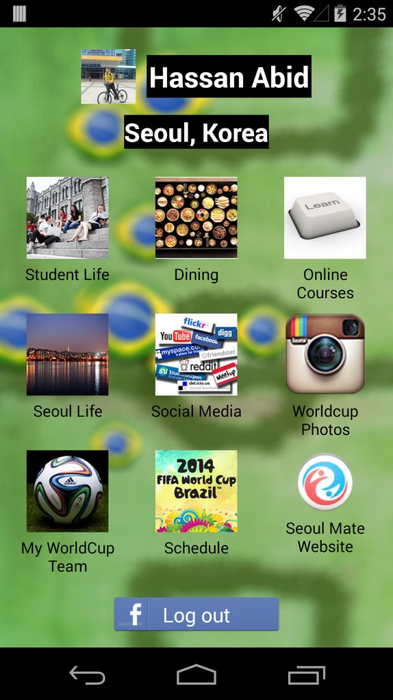
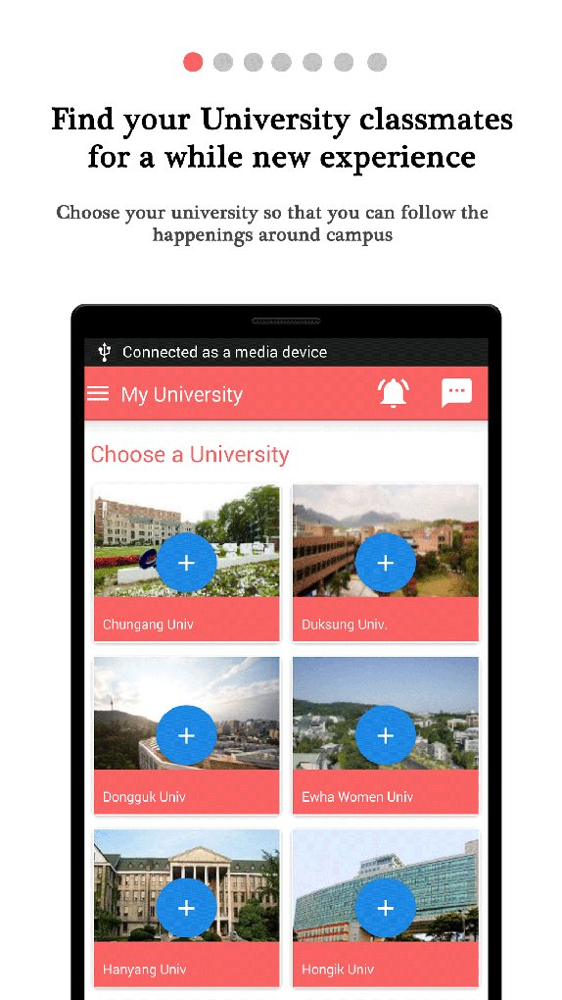
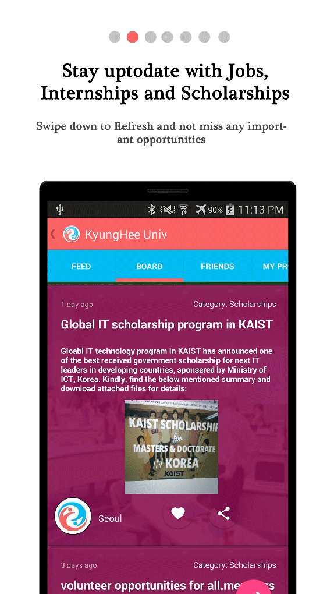
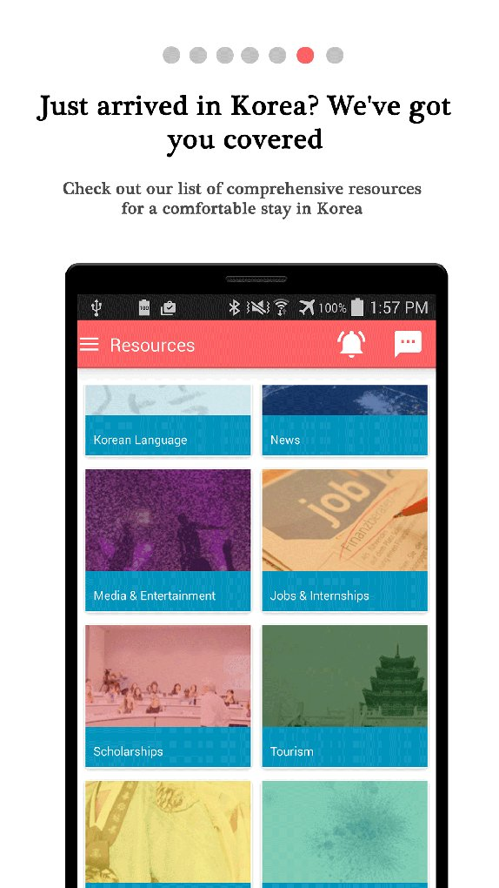

# Mid term Report Seoul Mate

Get presentation from <a href="#">slideshare</a> 

Seoul Mate idea was presented at Stream LAUNCH event in January. Since then we have been working hard to 
implement it. So far, we have released it for Android and iOS Platforms. Our next target is to make it CROSS-Platform and 
improve design and usability.

We launched new android version on March 31. So far we have 331 NEW USERS (From various universities in Seoul)

Screenshots 

 

 

 

Event link : http://streamprogram.co

 
